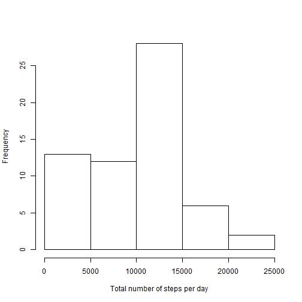
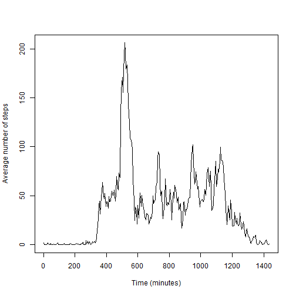
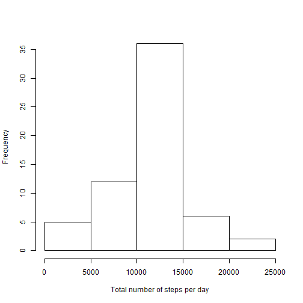
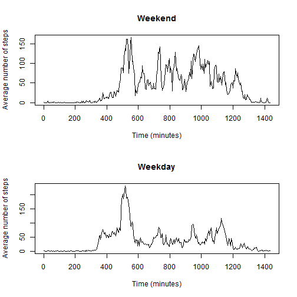

Reproducible Research - Peer Assignment 1
========================================================
Author's note: This document is produced for the Johns Hopkins/Coursera course, "Reproducible Research."  This document will be peer reviewed; therefore, I have chosen to list the question followed by the appropriate code/response.

Known issues: I am aware that the code that checks for the file does not run correctly due to an issue with converting the markdown file to html.  I chose to include it for completeness.  As the code runs fine in R, please disregard the "unsupported URL scheme" issue by assuming the file is available and the working directory is properly set.

### Loading and preprocessing the data
Show any code that is needed to
#### 1. Load the data (i.e. read.csv())

```r
# downloads the file if it is not in the working directory
if(!file.exists("activity.csv")){
  download.file("https://d396qusza40orc.cloudfront.net/repdata%2Fdata%2Factivity.zip", destfile = "rep_data_activity.zip")
  unzip("rep_data_activity.zip")
}

setwd("C:/Users/Ryan Seeto/Documents")
# reads the data
activity_data <- read.csv("activity.csv")
```


#### 2. Process/transform the data (if necessary) into a format suitable for your analysis

```r
# converts the date column in the "activity_data" dataframe into class "Date""
activity_data$date <- as.Date(as.character(activity_data$date), "%Y-%m-%d")
# convert interval from hours and minutes to consecutive minutes
for(i in 1:nrow(activity_data)){
  activity_data$interval[i] <- (floor(activity_data$interval[i] / 100) * 60) + (activity_data$interval[i] - (floor(activity_data$interval[i]/ 100)) * 100)
}
```
  
### What is mean total number of steps taken per day?
For this part of the assignment, you can ignore the missing values in the dataset.
#### 1. Make a histogram of the total number of steps taken each day

```r
# create an emtpy dataframe to store the relevant data
steps_all_days <- data.frame()

# for each day, sums the total number of steps
for(j in 0:(activity_data$date[nrow(activity_data)] - activity_data$date[1])){
  day_of_interest <- activity_data$date[1] + j
  day_activity_data <- subset(activity_data, activity_data$date == day_of_interest)
  day_steps <- sum(day_activity_data$steps, na.rm = TRUE)
  steps_all_days <- rbind(steps_all_days, data.frame(day_of_interest, day_steps))
}

#creates a histogram
hist(steps_all_days$day_steps, xlab = "Total number of steps per day", main = "")
```

 

#### 2. Calculate and report the mean and median total number of steps taken per day

```r
mean(steps_all_days$day_steps)
```

```
## [1] 9354.23
```

```r
median(steps_all_days$day_steps)
```

```
## [1] 10395
```
The mean total number of steps taken per day was 9354.2295082.  The median total number of steps taken per day was 10395.
  
### What is the average daily activity pattern?
### 1. Make a time series plot (i.e. type = "l") of the 5-minute interval (x-axis) and the average number of steps taken, averaged across all days (y-axis)

```r
steps_all_intervals <- data.frame()

for(k in seq((min(activity_data$interval)), (max(activity_data$interval)), 5)) {
  interval_activity_data <- subset(activity_data, activity_data$interval == k)
  interval_steps <- mean(interval_activity_data$steps, na.rm = TRUE)
  steps_all_intervals <- rbind(steps_all_intervals, c(k, interval_steps))
}

plot(steps_all_intervals[, 1], steps_all_intervals[, 2], type = "l", ylab = "Average number of steps", xlab = "Time (minutes)", main = "") 
```

 

### 2. Which 5-minute interval, on average across all the days in the dataset, contains the maximum number of steps?

```r
# subsets the dataframe based on the maximum number of steps
highest_step_average <- subset(steps_all_intervals, steps_all_intervals[, 2] == max(steps_all_intervals[, 2], na.rm = TRUE))
# print the associated 5-minute interval
highest_step_average[1, 1]
```

```
## [1] 515
```
  
### Imputing missing values
Note that there are a number of days/intervals where there are missing values (coded as NA). The presence of missing days may introduce bias into some calculations or summaries of the data.
#### 1. Calculate and report the total number of missing values in the dataset (i.e. the total number of rows with NAs)

```r
sum(is.na(activity_data$steps))
```

```
## [1] 2304
```

#### 2. Devise a strategy for filling in all of the missing values in the dataset. The strategy does not need to be sophisticated. For example, you could use the mean/median for that day, or the mean for that 5-minute interval, etc.
I chose to replace all "NAs" with the mean for the 5-minute interval.

#### 3. Create a new dataset that is equal to the original dataset but with the missing data filled in.

```r
activity_data_with_replacement <- activity_data

for(l in 1:nrow(activity_data)){
  if(is.na(activity_data$steps[l])){
replace_NA <- subset(steps_all_intervals, steps_all_intervals[, 1] == activity_data$interval[l]) 
activity_data_with_replacement$steps[l] <- replace_NA[1, 2]
  }
}

steps_all_days_with_replacement <- data.frame()

for(m in 0:(activity_data_with_replacement$date[nrow(activity_data)] - activity_data$date[1])){
  day_of_interest_with_replacement <- activity_data_with_replacement$date[1] + m
  day_activity_data_with_replacement <- subset(activity_data_with_replacement, activity_data_with_replacement$date == day_of_interest_with_replacement)
  day_steps_with_replacement <- sum(day_activity_data_with_replacement$steps, na.rm = TRUE)
  steps_all_days_with_replacement <- rbind(steps_all_days_with_replacement, data.frame(day_of_interest_with_replacement, day_steps_with_replacement))
}
```

#### 4. Make a histogram of the total number of steps taken each day and calculate and report the mean and median total number of steps taken per day. Do these values differ from the estimates from the first part of the assignment? What is the impact of imputing missing data on the estimates of the total daily number of steps?

```r
hist(steps_all_days_with_replacement$day_steps_with_replacement, xlab = "Total number of steps per day", main = "")
```

 

```r
mean(steps_all_days_with_replacement$day_steps_with_replacement)
```

```
## [1] 10766.19
```

```r
median(steps_all_days_with_replacement$day_steps_with_replacement)
```

```
## [1] 10766.19
```
By substituting the mean for the "NA" values, there is a significant increase in the frequency of the number of steps per interval. 
### Are there differences in activity patterns between weekdays and weekends?
For this part the weekdays() function may be of some help here. Use the dataset with the filled-in missing values for this part.
#### 1. Create a new factor variable in the dataset with two levels - "weekday" and "weekend" indicating whether a given date is a weekday or weekend day.

```r
# vector which states "weekend" or "weekday"
weekend_weekday <- factor()

# creates a vector listing the days of the week associated with the "activity_data_with_replacement" dataframe
divide_week <- weekdays(activity_data_with_replacement$date)

# converts the days of the week to "weekend" or "weekday"
for(n in 1:nrow(activity_data_with_replacement)){
  if(divide_week[n] == "Saturday" | divide_week[n] == "Sunday") {
    weekend_weekday <- c(weekend_weekday, "weekend")
    } else {
    weekend_weekday <- c(weekend_weekday, "weekday")
  }
}

activity_data_with_replacement <- cbind(activity_data_with_replacement, weekend_weekday)
```

#### 2. Make a panel plot containing a time series plot (i.e. type = "l") of the 5-minute interval (x-axis) and the average number of steps taken, averaged across all weekday days or weekend days (y-axis). See the README file in the GitHub repository to see an example of what this plot should look like using simulated data.

```r
# creates dataframes based on "weekend" or "weekday" classifcation
weekenddf <- subset(activity_data_with_replacement, weekend_weekday == "weekend")
weekdaydf <- subset(activity_data_with_replacement, weekend_weekday == "weekday")


weekenddf_steps_all_intervals <- data.frame()
for(o in seq((min(weekenddf$interval)), (max(weekenddf$interval)), 5)) {
  interval_activity_data <- subset(weekenddf, weekenddf$interval == o)
  interval_steps <- mean(interval_activity_data$steps, na.rm = TRUE)
  weekenddf_steps_all_intervals <- rbind(weekenddf_steps_all_intervals, c(o, interval_steps))
}

weekdaydf_steps_all_intervals <- data.frame()
for(p in seq((min(weekdaydf$interval)), (max(weekdaydf$interval)), 5)) {
  interval_activity_data <- subset(weekdaydf, weekdaydf$interval == p)
  interval_steps <- mean(interval_activity_data$steps, na.rm = TRUE)
  weekdaydf_steps_all_intervals <- rbind(weekdaydf_steps_all_intervals, c(p, interval_steps))
}

par(mfrow=c(2,1))
plot(weekenddf_steps_all_intervals[, 1], weekenddf_steps_all_intervals[, 2], type = "l", ylab = "Average number of steps", xlab = "Time (minutes)", main = "Weekend")
plot(weekdaydf_steps_all_intervals[, 1], weekdaydf_steps_all_intervals[, 2], type = "l", ylab = "Average number of steps", xlab = "Time (minutes)", main = "Weekday")
```

 
